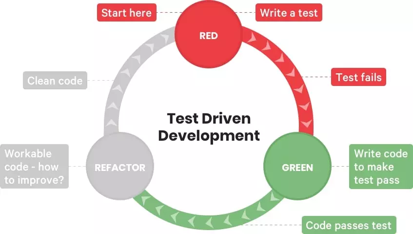

# Advanced social coding and devops
Assume that you are working with a group on a research software code base. At this point your codebase is considerably big, dozens of scripts, it has a good amount of dependencies and there are people that depend on your code to work. When your code becomes more relevant to yourself and your community you inmediately will feel the urge to have more control on the quality of contributions, the easiness to upgrade and maintain the code, among other things. 

**There are a set of practices that come very handy when being in such a situation:**
- Branch management using a "main/master" branch for stable release and a "develop" branch for beta releases. Read more in ["A successful Git branching model"](https://nvie.com/posts/a-successful-git-branching-model/)
- Working with branch names such as bugfix/<#Issue Number>
- Using issues to keep track of things to do in your code (this is mostly project management)
- Writing automated tests to check that key functionaly and code behaviour specifications are met.
- Integrate testing into your release and contribution workflow. For instance every new feature should ideally come with its test.

## About testing
> Unit testing is a type of testing in which individual units or functions of software testing. Its primary purpose is to test each unit or function. A unit is the smallest testable part of an application. It mainly has one or a few inputs and produces a single output.

- Use tests as check-points to make sure your code is not breaking, this is particularly useful when your code base is growing considerably.
- Tests help you to specify better your software and approach it in a more modular/functional way.

## About Continuous Integration and deployment
**A simple use case:** If you want to have a release management process where you want to make sure that releases have a good test coverage then consider seriously running your tests with job runners. Runners are isolated virtual machines or environments that run predefined steps/jobs/actions in a pipeline (e.g. install python, and pytest, then run test 1, test 2 and test 3). This could happen when some one makes a pull request/merge request and ensures a better code quality control. Examples of these runners are [Gitlab runners](https://docs.gitlab.com/runner/), [Github Actions](https://github.com/features/actions).

There is more than this, as you could do all kinds of workflows for different purposes, not just for testing.

## Things you can do to get a quick feel about the benefits of these practices
### Try TDD (test driven development) methodology in one of your projects
Follow the steps in the image, starting with writing tests.
 

### Try github Actions and continuous integration
[Here is a nice Github tutorial to practice to quickly get started with CI/CD](https://lab.github.com/githubtraining/github-actions:-continuous-integration)

Would you dare to combine TDD and github actions in your project?

:::{warning}
Remember that many of these techniques and approaches come from the software industry, in science and research is good to adopt them appropriately. The context is different, as well as the pace and the approach. 
:::